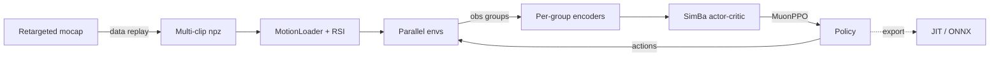

**A single RL policy learns to reproduce mocap-retargeted manipulation motion on a Unitree G1 with Inspire dexterous hands — matching body pose, object pose, and hand contacts.**

[Highlights](#-highlights) · [Architecture](#-architecture) · [Installation](#-installation) · [Data Pipeline](#-data-pipeline) · [Training](#-training) · [Play](#-evaluation--play)

---

## ✨ Highlights

- **Contact-aware imitation** — tracks the reference body + object trajectory *and* the per-hand contact labels, so the policy grasps when (and where) the reference does.
- **Dexterous bimanual control** — G1 body + 2× Inspire hands; the passive finger joints are driven from a software mimic table, so the policy commands only the active DoF.
- **SimBa + MuonPPO** — a residual-MLP actor-critic trained by a Muon (2-D weights) / AdamW (rest) hybrid PPO, with per-observation-group encoders and an asymmetric actor/critic.
- **Multi-object, multi-clip** — round-robin object assignment across thousands of reference clips in a single training run.
- **RSI + domain randomization** — reset to a random clip and frame with small robot pose/velocity/joint and object-position perturbations.
- **Object shape conditioning** — each object's surface is embedded by a frozen PointNet++ into a compact descriptor.

## 🧭 Architecture



---

## 📁 Project Layout

```
g1_hoi_learning/
├── configs/
│   ├── track/                    # {train,play}.yaml — HOI tracker (Hydra env/agent overrides)
│   └── distill/                  # {train,play}.yaml — goal-conditioned distillation (WIP)
├── data/
│   ├── train/                    # <obj>_<N>clip.npz — packed multi-clip TRAIN sets
│   └── test/                     # <obj>_<N>clip.npz — packed multi-clip TEST sets
├── scripts/
│   ├── data_replay_multiple.py   # pack clips of one object (a dict pkl) → one multi-clip npz
│   ├── sample_object_points.py   # sample (P, 3) surface points from .obj per object
│   ├── list_envs.py
│   └── rsl_rl/
│       ├── train.py              # PPO training entry
│       ├── play.py               # checkpoint evaluation + JIT/ONNX export
│       └── cli_args.py           # RSL-RL specific argparse helpers
├── third_party/
│   └── pointnet2_ops_lib/        # PointNet++ CUDA ops
└── source/g1_hoi_learning/g1_hoi_learning/
    ├── algorithms/
    │   ├── networks.py           # shared SimBa backbone
    │   ├── optimizers.py         # Muon (2-D weights) + AdamW (rest) split
    │   ├── ppo/                  # MuonPPO — GroupEncoder (per-obs-group) + SimBa actor-critic + runner
    │   └── distillation/         # MuonPPODistill + SimBa student/teacher — WIP
    ├── models/                   # PointNet++ object point-cloud encoder
    │   ├── object_encoder.py     # normalize → PointNet++ → mean-pool → (B, 128)
    │   └── pointnet2_rl_encoder.py / pointnet2_rl_seg.py   # PointNet++ backbone
    ├── assets/                   # G1 + Inspire hand URDF + meshes
    ├── objects/                  # household object configs + USD/OBJ + surface.npy
    ├── robots/g1_inspire.py      # G1 + Inspire hand articulation cfg
    └── tasks/hoi/
        ├── __init__.py           # gym.register with _make_env factory
        ├── env_cfg.py            # ManagerBasedRLEnvCfg (scene/obs/act/rew/term)
        ├── agents/rsl_rl_ppo_cfg.py      # PPORunnerCfg (SimBa + MuonPPO knobs)
        └── mdp/                          # commands, observations, actions, rewards, terminations
```

---

## 🔧 Installation

1. Install [uv](https://docs.astral.sh/uv/#installation) by
  ```bash
    curl -LsSf https://astral.sh/uv/install.sh | sh
    uv venv --python 3.11 sim51
    uv pip install pip

  ```
2. Install [Isaac Sim 5.1](https://docs.isaacsim.omniverse.nvidia.com/5.1.0/installation/download.html) and follow the steps in [Installation](https://docs.isaacsim.omniverse.nvidia.com/5.1.0/installation/install_workstation.html)
  ```bash
    mkdir $workspace/isaacsim
    # take x86_64 as an example
    unzip "isaac-sim-standalone-5.1.0-linux-x86_64.zip" -d $workspace/isaacsim
    cd $workspace/isaacsim
    ./post_install.sh
    export ISAACSIM=$workspace/isaacsim
  ```
3. Clone the [IsaacLab](https://github.com/isaac-sim/IsaacLab) repository and checkout to commit `e1731280`
4. Install IsaacSim and IsaacLab in the `sim51` venv
  ```bash
    # enter the cloned repository
    cd IsaacLab
    git checkout e17312889676ed229b986d56c9e0b23a01cf0ab7
    # create a symbolic link
    ln -s ${ISAACSIM} _isaac_sim

    ./isaaclab.sh --uv sim51

    ./isaaclab.sh -i rsl_rl
  ```
5. Install [torch>=2.10](https://pytorch.org/get-started/locally/)
  ```bash
    uv pip install 'torch>=2.10' torchvision
  ```
6. Sideline Isaac Sim's bundled torch/torchvision/nvidia (required for Muon optimizer + venv torch ABI):
  ```bash
   PREBUNDLE=$ISAACSIM/exts/omni.isaac.ml_archive/pip_prebundle
   mv $PREBUNDLE/torch       $PREBUNDLE/torch.bak
   mv $PREBUNDLE/torchvision $PREBUNDLE/torchvision.bak
   mv $PREBUNDLE/nvidia      $PREBUNDLE/nvidia.bak
  ```
7. Clone this repo outside the `IsaacLab` directory.
8. Install the extension in editable mode using your Isaac Lab Python interpreter:
  ```bash
   python -m pip install -e source/g1_hoi_learning
  ```
9. Build the **PointNet++ CUDA ops** required by the object point-cloud encoder. This compiles a CUDA extension, so it needs an `nvcc` whose **major** version matches your venv PyTorch's CUDA build.
  **If your system `nvcc` already matches** (e.g. both CUDA 12.x), it's a one-liner:
   **If they differ** (this repo's setup: PyTorch **cu130** but system `nvcc` is 12.x), install a matching CUDA-13 toolchain into the venv and build against it. The steps below are verified for **PyTorch cu130 + RTX 4090 (sm_89)**:
   Verify the ops load and execute on the GPU:
10. Verify:
  ```bash
   python scripts/list_envs.py
  ```

---

## 🧩 Data Pipeline

### Step 1 — sample surface points

For each object, generate `surface.npy` (P=512 surface points in object-local frame, used by the `object_nearest_point_b` observation and by the frozen PointNet++ `object_point_cloud_b` encoder):

```bash
python scripts/sample_object_points.py --name clothesstand --num_points 512
# repeat for floorlamp, largebox, ...
```

Output: `source/g1_hoi_learning/g1_hoi_learning/objects/<name>/surface.npy`.

### Step 2 — pack clips of one object → one multi-clip npz

`data_replay_multiple.py` kinematically replays every clip of an object through Isaac Sim, captures per-frame body/object world states, and concatenates them into a single packed npz for multi-clip RL training:

```bash
python scripts/data_replay_multiple.py \
    --input_file  ./data/retargeted/smalltable_train.pkl \
    --output_file ./data/train/smalltable_279clip.npz \
    --input_fps 30 --output_fps 50 --headless
```

---

## 🚀 Training

Training uses a **Hydra YAML config** (`configs/track/train.yaml`) that overrides the registered base task. Edit the YAML to change motion files, num_envs, reward weights, network size, etc. The default config trains across all 11 objects in `data/train/`.

### Default usage

```bash
python scripts/rsl_rl/train.py --task=G1-Inspire-HOI-v0 \
    --config-dir ./configs/track --config-name train
```

`train.py` defaults to **headless mode**.

### Inline overrides

Hydra-style `key=value` overrides still work alongside the YAML:

```bash
python scripts/rsl_rl/train.py --task=G1-Inspire-HOI-v0 \
    --config-dir ./configs/track --config-name train \
    env.scene.num_envs=8192 \
    agent.max_iterations=500 \
    agent.algorithm.learning_rate=5.0e-4
```

### Resume from checkpoint

```bash
python scripts/rsl_rl/train.py --task=G1-Inspire-HOI-v0 \
    --config-dir ./configs/track --config-name train \
    --resume --load_run 2026-05-09_14-23-11 --checkpoint model_500.pt
```

### Custom run name

```bash
python scripts/rsl_rl/train.py --task=G1-Inspire-HOI-v0 \
    --config-dir ./configs/track --config-name train \
    --run_name multiobj-baseline
```

Logs go to `logs/rsl_rl/g1_inspire_hoi/<timestamp>_<run_name>/`.

### TensorBoard

```bash
tensorboard --logdir logs/rsl_rl --port 6006
# open http://localhost:6006
```

---

## 🎬 Evaluation & Play

Eval uses `configs/track/play.yaml`, which inherits from `train.yaml` and overrides
`num_envs=1` and turns off RSI / reset perturbations for deterministic playback.

```bash
# play the most recent checkpoint
python scripts/rsl_rl/play.py --task=G1-Inspire-HOI-v0 \
    --config-dir ./configs/track --config-name play

# switch object inline (or edit play.yaml)
python scripts/rsl_rl/play.py --task=G1-Inspire-HOI-v0 \
    --config-dir ./configs/track --config-name play \
    env.commands.motion.motion_files=[./data/test/floorlamp_34clip.npz]

# specific run / checkpoint
python scripts/rsl_rl/play.py --task=G1-Inspire-HOI-v0 \
    --config-dir ./configs/track --config-name play \
    --load_run 2026-05-09_14-23-11 --checkpoint model_2000.pt

# record a video
python scripts/rsl_rl/play.py --task=G1-Inspire-HOI-v0 \
    --config-dir ./configs/track --config-name play \
    --video --video_length 500
```

`play.py` automatically:

- runs in non-headless mode (GUI),
- exports `policy.pt` (TorchScript) and `policy.onnx` to `<run_dir>/exported/`.

---

## 🧹 Code Formatting

```bash
pip install pre-commit
pre-commit run --all-files
```

ruff (line length 120, py3.10+ target) + codespell.