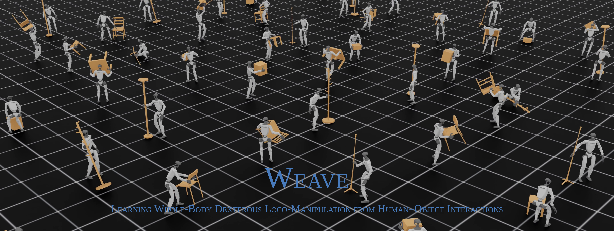

<p align="center">
  
</p>

## 🔧 Installation

1. Create a workspace directory — everything (Isaac Sim, IsaacLab, the venv, this repo) is installed side by side inside it, so pick a disk with **~30 GB** free:
  ```bash
    export WORKSPACE=$HOME/g1_hoi_ws     # any path you like
    mkdir -p "$WORKSPACE" && cd "$WORKSPACE"
  ```

2. Clone the repository
  ```bash
    git clone https://github.com/xiaohu-art/Weave.git
    cd Weave
    git lfs install && git lfs pull
  ```

3. Installation
  ```bash
    bash ./install.sh
  ```

4. Verify:
  ```bash
   python scripts/list_envs.py
  ```

---

## 🚀 Training

Training uses a **Hydra YAML config** (`configs/track/train.yaml`) that overrides the registered base task. Edit the YAML to change motion files, num_envs, reward weights, network size, etc. The default config trains across all 9 objects in `data/train/`.

### Default usage

```bash
python scripts/rsl_rl/train.py --task=G1-Inspire-HOI-v0 \
    --config-dir ./configs/track --config-name train
```

`train.py` defaults to **headless mode**.

### Inline overrides

Hydra-style `key=value` overrides still work alongside the YAML:

```bash
python scripts/rsl_rl/train.py --task=G1-Inspire-HOI-v0 \
    --config-dir ./configs/track --config-name train \
    env.scene.num_envs=8192 \
    agent.max_iterations=500 \
    agent.algorithm.learning_rate=5.0e-4
```

### Resume from checkpoint

```bash
python scripts/rsl_rl/train.py --task=G1-Inspire-HOI-v0 \
    --config-dir ./configs/track --config-name train \
    --resume --load_run 2026-05-09_14-23-11 --checkpoint model_500.pt
```

### Custom run name

```bash
python scripts/rsl_rl/train.py --task=G1-Inspire-HOI-v0 \
    --config-dir ./configs/track --config-name train \
    --run_name multiobj-baseline
```

Logs go to `logs/rsl_rl/g1_inspire_hoi/<timestamp>_<run_name>/`.


### Multi-GPU training

```bash
# single node, 2 GPUs
python -m torch.distributed.run --nnodes=1 --nproc_per_node=2 \
    scripts/rsl_rl/train.py --task=G1-Inspire-HOI-v0 --distributed \
    --config-dir ./configs/track --config-name train
```

```bash
# two nodes, 2 GPUs each -- run on the master (node_rank=0), then on each worker with node_rank=1, ...
python -m torch.distributed.run --nnodes=2 --nproc_per_node=2 --node_rank=0 \
    --master_addr=<master-ip> --master_port=5555 \
    scripts/rsl_rl/train.py --task=G1-Inspire-HOI-v0 --distributed \
    --config-dir ./configs/track --config-name train
```

### TensorBoard

```bash
tensorboard --logdir logs/rsl_rl --port 6006
# open http://localhost:6006
```

---

## 📊 Evaluation

`eval.py` scores a checkpoint clip by clip: it maps **one env per clip**, 
and writes aggregate metrics to `<run_dir>/eval/metrics.json`. 
It uses `configs/track/eval.yaml`, which inherits `train.yaml` and turns on `eval_mode`.

```bash
# evaluate the most recent checkpoint over every clip in eval.yaml
python scripts/rsl_rl/eval.py --task=G1-Inspire-HOI-v0 --headless \
    --config-dir ./configs/track --config-name eval

# a specific run / checkpoint, on a different clip set
python scripts/rsl_rl/eval.py --task=G1-Inspire-HOI-v0 --headless \
    --config-dir ./configs/track --config-name eval \
    --load_run 2026-05-09_14-23-11 --checkpoint model_2000.pt \
    env.commands.motion.motion_files=[./data/test/floorlamp_34clip.npz]

# write the report somewhere else
python scripts/rsl_rl/eval.py --task=G1-Inspire-HOI-v0 --headless \
    --config-dir ./configs/track --config-name eval \
    --output_dir ./outputs/eval-baseline
```

---

## 🎬 Play

`play.yaml` inherits from `train.yaml` and overrides `num_envs=1`, turning off RSI / reset
perturbations for deterministic playback.

```bash
# play the most recent checkpoint
python scripts/rsl_rl/play.py --task=G1-Inspire-HOI-v0 \
    --config-dir ./configs/track --config-name play

# switch object inline (or edit play.yaml)
python scripts/rsl_rl/play.py --task=G1-Inspire-HOI-v0 \
    --config-dir ./configs/track --config-name play \
    env.commands.motion.motion_files=[./data/test/floorlamp_34clip.npz]

# specific run / checkpoint
python scripts/rsl_rl/play.py --task=G1-Inspire-HOI-v0 \
    --config-dir ./configs/track --config-name play \
    --load_run 2026-05-09_14-23-11 --checkpoint model_2000.pt

# record a video
python scripts/rsl_rl/play.py --task=G1-Inspire-HOI-v0 \
    --config-dir ./configs/track --config-name play \
    --video --video_length 500
```

`play.py` automatically:

- runs in non-headless mode (GUI),
- exports `policy.pt` (TorchScript) and `policy.onnx` to `<run_dir>/exported/`.

---

## 📷 Rollout collection

`collect.py` samples 100 unique clips from the 805-clip floor-lamp reference set, executes one clean rollout per
clip, and records synchronized robot/object state, contacts, references, policy observations/actions, rewards, and
224×224 head-camera RGB-D. Sampling defaults to seed 42; both successful and failed episodes are retained.

```bash
python scripts/rsl_rl/collect.py --task=G1-Inspire-HOI-v0 \
    --config-dir ./configs/track --config-name collect \
    --load_run <run-directory> --checkpoint model_2000.pt \
    --num_rollouts 100 --sampling_seed 42 \
    --output_dir ./datasets/floorlamp_rollout_100_seed42
```

Change `--num_rollouts` to collect a different number of unique references. If `--output_dir` is omitted, its default
name is generated from `--num_rollouts` and `--sampling_seed`.

The output directory contains `rollouts.h5`, `manifest.json`, the sampled clip list, and the resolved configuration.
Depth is stored losslessly as unsigned 16-bit millimeters (`0` means invalid); RGB is stored as `uint8`. Positions
use world-aligned axes with each parallel environment's origin removed, and quaternions use `wxyz` ordering.

Validate a completed collection with:

```bash
python scripts/inspect_rollout.py ./datasets/floorlamp_rollout_100_seed42
```

---

## 🧹 Code Formatting

```bash
pip install pre-commit
pre-commit run --all-files
```

ruff (line length 120, py3.10+ target) + codespell.
